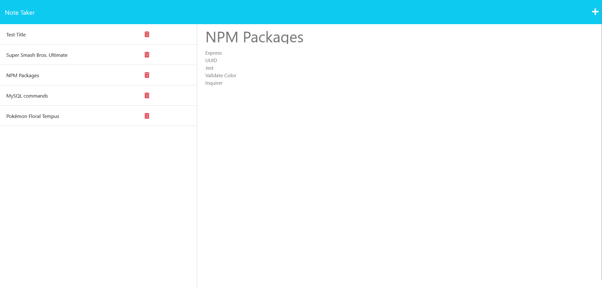

# Note-Taker-Deluxe
  

  
## Description
  
Note-Take-Deluxe is a note taker webapp that allows the user to save notes. The notes are stored in a database that is only accessible through an API.
  
## Table of Contents
  
- [Installation](#installation)
- [Usage](#usage)
- [License](#license)
- [Contributing](#contributing)
- [Media](#media)
- [Credits](#credits)
  
## Installation
  
N/A

## Technologies
  
- NodeJS
- NPM Express
- NPM UUID
  
## Usage

Go to this site: (<https://cryptic-sands-85445-cb7b58f3dad1.herokuapp.com/>)

On the homepage, click 'Get Started' to begin.

When using the webpage, clicking an old entry will post it on the right column. Clicking the plus symbol on the top right, will clear the field and ready the notes for a new entry. When both fields are filled in, the save symbol will appear next to the plus symbol. Clicking the save symbol will send the current note to the API to be saved.
  
## License
  
This project is covered under the MIT license.
  
## Contributing
  
## Media

  
## Credits

  Ediubong Ekwere | JunoAndIce

  <https://github.com/JunoAndIce> | [ekwere.edi@gmail.com](mailto:ekwere.edi@gmail.com)
  